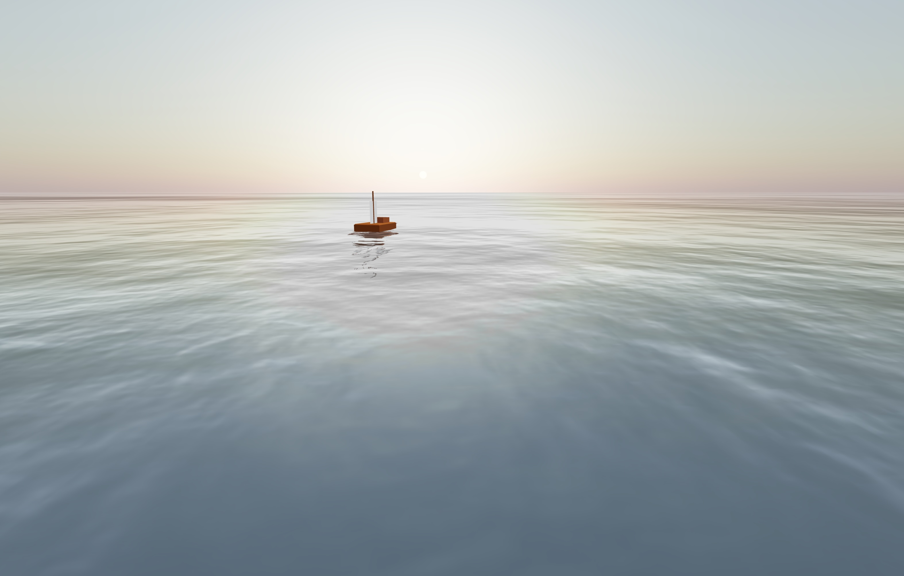

# Three.js サンプル

Three.js を使用したサンプルアプリケーション

## 概要

- React と TypeScript を使用してUIを構築
- Three.js を使用して3Dグラフィックスを描画



## 必要条件

- Node.js (バージョン 14 以上)
- npm 

## セットアップと実行手順

1. リポジトリをクローンします：
   ```
   git clone https://github.com/itwuthe3/webgpu-sample.git
   cd webgpu-sample
   ```

2. 依存関係をインストールします：
   ```
   npm install
   ```

3. アプリケーションをビルドします：
   ```
   npm run build
   ```

4. サーバーを起動します：
   ```
   node server.js
   ```

5. ブラウザで `http://localhost:3000` にアクセスして、アプリケーションを表示します。

## 操作方法

- 矢印キーを使用して船を操作できます：
  - 上矢印キー: 前進
  - 下矢印キー: 後退
  - 左矢印キー: 左回転
  - 右矢印キー: 右回転
