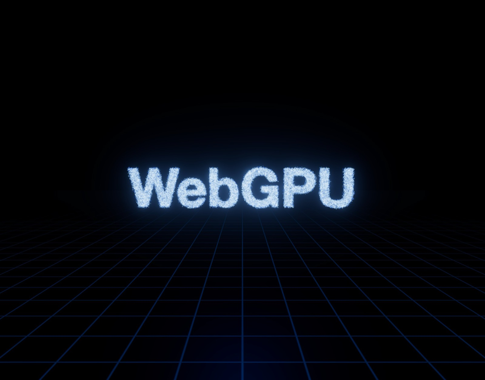

# Three.js WebGPU サンプル

Three.js の WebGPU レンダラーと TSL（Three.js Shading Language）で書いた 3D サンプル集です。
自然の中の光の揺らぎを、絵として描くのではなく、その場で計算して出しています。

## 概要

- 5本のサンプルはすべて `WebGPURenderer` + TSL。粒子はコンピュートシェーダーで更新しています
- React と react-router は、一覧ページとページ振り分けにだけ使っています
- TypeScript / esbuild。ビルドは 1 コマンドで完結します


## 必要条件

- Node.js (バージョン 14 以上)
- npm 

## セットアップと実行手順

1. リポジトリをクローンします：
   ```
   git clone https://github.com/itwuthe3/webgpu-sample.git
   cd webgpu-sample
   ```

2. 依存関係をインストールします：
   ```
   npm install
   ```

3. アプリケーションをビルドします：
   ```
   npm run build
   ```

4. サーバーを起動します：
   ```
   node server.js
   ```

5. ブラウザで `http://localhost:3000` にアクセスして、アプリケーションを表示します。


## サンプル一覧

`http://localhost:3000/` を開くと一覧ページが出ます。ローカルのサーバーには SPA フォールバックが
無いため、`/flame` などへ直接アクセスすると 404 になります。必ず一覧から遷移してください
（公開版は `_redirects` を置いてあるので直リンクできます）。

各サンプルは `WebGPURenderer` と TSL（WGSL を JavaScript で組み立てる仕組み）で書かれています。
React Three Fiber は使わず、[`WebGPUCanvas.tsx`](src/components/webgpu/WebGPUCanvas.tsx) が
レンダラーの非同期初期化・リサイズ・描画ループ・fps 表示だけを引き受け、各サンプルは素の
Three.js でシーンを組み立てています。

木漏れ日・炎・水面に出てくるオブジェクト（木・林床・切り株・倒木・岩・薪）は、すべて
[Poly Haven](https://polyhaven.com/) の **CC0（パブリックドメイン）** アセットです。
[assets/polyhaven/](assets/polyhaven/) に同梱しているので、実行時の外部ダウンロードはありません。
モデルは meshopt で圧縮してあり（木は 39MB → 9MB）、合計およそ 32MB です。詳細は
[assets/polyhaven/CREDITS.md](assets/polyhaven/CREDITS.md)。ロウソクと3Dテキストの2本は、
形も質感もすべて手続き生成で、外部アセットを使っていません。

> WebGPU 非対応のブラウザでは、その旨のメッセージが表示されます。
> Chrome / Edge / Safari の最新版でお試しください。

### 木漏れ日（`/komorebi`）


木はフォトグラメトリの完全なモデル（`island_tree_02`、1本あたり **107万三角形**）をそのまま
林として並べています。幹・枝・葉が別マテリアルになっているので、部位ごとに塗り分けています。

そのうえで、**太陽の位置から見た「葉に遮られたか」を毎フレーム RenderTarget に焼いています**
（＝自前の影マップ）。

- 地面・切り株・倒木・岩の陰影：そのマップをぼかして引く
- 空中の光の柱：カメラから伸ばしたレイ上で26回サンプルして積分する
- 漂う8万個の塵：マップが明るいところに入った粒だけがきらめく
- 葉自身の陰影：自分を数えないよう太陽側にずらして引き、樹冠の内側を暗くする

葉はモデルローカル座標のノイズで風に揺らしていて、影マップ側も同じ計算を使うので、
葉が揺れると地面の光斑も一緒に揺れます。

**上にドラッグすると見上げられます。** 葉が裏から陽を透かして光り、隙間から陽が漏れます。


### 炎の揺らぎ（`/flame`）


**拡散炎が光るのは、燃料と空気が出会う「面」の上だけです。** 実際の焚き火が薄いリボンの
集まりに見え、隙間から向こうが透けるのはこのため。粒子はその面を離散的に拾うことしか
できず、22万個まで増やしても「点の集まり」から抜け出せませんでした。そこで炎そのものは
**発光する参加媒質**としてレイマーチし、乱流に折り畳まれた面（ノイズ場のゼロ等値面）を
積分しています。一方、火の粉は本当に離散した炭素の粒なので、そちらは粒子のままです。

**炎は薪ごとに立ち上がります。** 軸対称な涙型をひとつ置くと、どれだけ大きくしても
ロウソクにしか見えません。薪の位置に合わせた6つの根元をそれぞれ別の太さ・高さ・位相で持ち、
その和集合を取ると、高いところで自然に1本のプルームへ合流します。

**しかも、その6つは独立ではありません。** 近接した拡散炎は内側どうしのせん断層が干渉し、
間の空気の巻き込みが妨げられるため、互いに引き寄せ合って合流し、空気不足で背が高くなり、
脈動の位相が揃います。位相が揃うか反転するかは間隔で決まり（近いと同位相、離れると逆位相）、
ここでは根元の間隔が径の 0.2〜1.3 倍なので同位相の領域です。実測すると、根元では横方向に
76px 広がっている炎が、上では 26px まで寄り集まります。

**風はランダムな突風として吹きます。** サインの和をそのまま使うと「常に揺れている」状態に
なってしまうので、しきい値で切って突風にしています（静穏が7割、平均4秒の突風が11秒に1回）。
風は時刻だけの関数にしてあり、高さ h の空気は τ = h/v 秒前に根元で受けた風になびくので、
S字が下から伝わります。突風のあいだは酸素が入って炎が伸び、明るくなり、輪郭が荒れ、
火の粉が横に流されます。

色はロウソクと同じく**黒体放射**から出しています。薪の輝炎の 980〜1750K を色温度→RGB で
引いたもので、明るさは Stefan–Boltzmann の T^4。火の粉はさらに低温（780〜1320K）なので、
赤く沈みます。

揺らぎも同じ法則から出しています。ただしロウソクとは**結論が逆**で、焚き火は臨界サイズを
超えているため常時脈打ちます。f ≈ 1.5/√D（D は火床の直径）に直径 0.8m を入れると **1.7Hz**。
焚き火が塊で「ボワッ」と立ちのぼって見えるのは、この渦輪が下から上へ抜けていくところです。
実際に描画結果の輝度を測ると 1.7Hz にピークが立ちます。

薪はスキャンした樹皮の塊（`bark_debris_01`）、囲いの石は乾いた岩（`namaqualand_boulders_01`）です。
どちらも火に近い側ほど炭化・煤けるよう塗り分けていて、薪は炭の割れ目から熾火が明滅して覗きます。

### ロウソクの火（`/candle`）


これだけは粒子で描いていません。実際の炎は煤の粒子（〜100nm）が高密度で光る連続体なので、
スプライトを重ねるとどうしても粒状感が残ります。ここでは炎を**発光する参加媒質**として扱い、
カメラからのレイを積分しています（Nguyen, Fedkiw & Jensen, SIGGRAPH 2002 と同じ立場）。

燃焼工学の知見を、そのまま3つ実装に落としています。

1. **色は黒体放射から出す。** ロウソクの黄色は炎の色ではなく、1100〜1900K に熱せられた煤の
   熱放射です。温度場を置いて、色温度から RGB を引いています。先端が白いのは白い色が
   あるのではなく、そこが最も高温で明るく、トーンマッピングが飽和した結果です。
2. **根元の青は熱放射ではない。** CH*(431nm) と C2* のスワンバンド(473/516nm)による化学発光で、
   煤ができる前の反応帯にだけ現れます。だから薄い殻として別に足しています。
3. **1本のロウソクは、実は「ちらついていない」。** 浮力が生む Kelvin–Helmholtz 型の
   不安定性による 9〜13Hz の自励振動は、臨界サイズを超えた炎——ロウソクなら3本以上を
   束ねて炎が融合した場合——に現れるもので、1本の炎の振動は過渡的にしか起きません。
   静穏時に見えているのは 0.1〜0.7Hz のゆっくりしたなびきです。しかも炎はプルームなので、
   高さ h の位置は根元が τ = h/v 秒前にした動きをなぞります（v ≒ 0.4m/s）。
   この遅れを入れると、振り子のように振れるのではなく S 字が下から伝わる動きになります。
   11Hz の成分はごく弱い残差として置き、**息を吹きかけて乱したときだけ立ち上がります。**

縦横比はおよそ 4.5:1。

**実際に息を吹きかけられます。** 「🎤 マイクで吹きかける」を押すとマイクの音から息の強さを
取り出し、弱ければ炎が傾いてちらつくだけ、強ければ芯から引き剥がされて消えます。息の音は
低い帯域に偏った広帯域雑音なので、80〜600Hz のエネルギーとその比率で話し声と切り分けています。
音はブラウザ内で解析しているだけで、録音も送信もしていません。マイクを使わない場合は
**スペースキー長押し**でも同じことができます（押し続けるほど強くなります）。

消えたあとは芯がしばらく赤熱し、白い煙がひとすじ立ちのぼります。光源が無くなるので、
暗順応（露出を 1.5 秒かけて上げる）を入れて手元が見えるようにしてあります。
**画面をタップすると再点灯します。**

ロウソク本体・垂れたロウ・芯・燭台・机は、すべて `LatheGeometry` と TSL のノイズによる手続き生成です。
溶けた縁は、旋盤形状のままだと回転対称で作り物に見えるので、頂点を角度ごとに歪ませています。

### 日の当たる水面（`/water-caustics`）


波を模様で描くのではなく、256×256 の格子で波動方程式を解いています。

1. 高さ場をコンピュートシェーダーで2ステップ進める（ping-pong する2つのバッファ）
2. その曲率から集光度（caustics）を別のバッファに焼く
3. 水面メッシュは頂点シェーダーで高さ場を読んで変位し、法線から空と太陽を反射する

水面のきらめきも水底で踊る光の網も、同じ1枚の高さ場から出てきます。
水底に沈めた苔むした岩（`rock_moss_set_01` / `_02` の13種）にも、深さから逆算した同じ式で
光の網が落ちます。マウスを水面に重ねると、その位置に波紋が立ちます。

### 文字が舞う3Dテキスト（`/text-input-3d`）



キーボードで入力した文字が、6.5万個の粒子で浮かび上がります。**Enter を押すと爆散します。**

文字はメッシュでは描いていません。裏のキャンバスに 2D で文字を描き、光ったピクセルを
「粒子の目的地」として RGBA float のテクスチャに焼き、粒子はそこへバネで吸い寄せられます。
入力のたびに目的地を割り当て直すので、文字が組み替わるように移り変わります。

Enter を押すと目的地を無視して外向きの力に切り替わり、青かった粒子が白 → 橙 → 赤へ
落ちながら散っていきます。2秒後に畳まれて、また入力を待ちます。

### ポストエフェクト

どのサンプルも `RenderPipeline` に bloom を挟んでいます。葉の隙間から漏れる陽、熾火、
水面のきらめき、ロウを透かす灯りといった「明るいところ」が滲むことで、
光そのものが見えるようになります。


## 表示言語

日本語と英語に対応しています。ブラウザの言語設定とタイムゾーンのどちらかが日本を指していれば
日本語、それ以外は英語で表示します。画面右上のボタンでいつでも切り替えられ、選択は次回以降も
引き継がれます。

## 公開する

完全な静的サイトなので、静的ホスティングならどこでも動きます。ここでは Cloudflare Pages を
前提にした手順を書いておきます（帯域が無制限で、ルートドメインで配信されるため）。

```bash
npm run build:site            # site/ に配信物一式（約 32MB / 58 ファイル）を作る
npx wrangler pages dev site   # _redirects 込みで手元で確認する
```

Cloudflare Pages のプロジェクト設定はこれだけです。

| 項目 | 値 |
|---|---|
| ビルドコマンド | `npm run build:site` |
| ビルド出力ディレクトリ | `site` |

Node のバージョンは [.nvmrc](.nvmrc) で 22 に固定しています。Cloudflare Pages の既定が古いと
`node:fs/promises` の `cp` が無くてビルドスクリプトが落ちるためです。

- [_redirects](_redirects) が SPA フォールバック（どのパスでも `index.html` を返す）を担います。
  これが無いと `/flame` へ直接アクセスしたときに 404 になります。
- [_headers](_headers) でモデルとテクスチャに1日のキャッシュを効かせています。
  `dist/bundle.js` は毎回変わるので、あえて指定していません。
- WebGPU もマイクも **HTTPS（secure context）が必須**です。`localhost` は例外扱いなので手元では
  動きますが、`http://192.168.x.x` などでは動きません。

### 独自ドメインを当てる

サブドメイン（`webgpu.example.com` など）なら、レジストラの DNS に
`<プロジェクト名>.pages.dev` への CNAME を1本足すだけです。

**ルートドメイン（`example.com`）を使う場合は、ネームサーバーを Cloudflare に向けます。**
DNS の仕様上ルートに CNAME は置けず、Cloudflare 側の CNAME フラット化が必要になるためです。
ドメインの登録自体は移管されず、更新も元のレジストラのままです。
