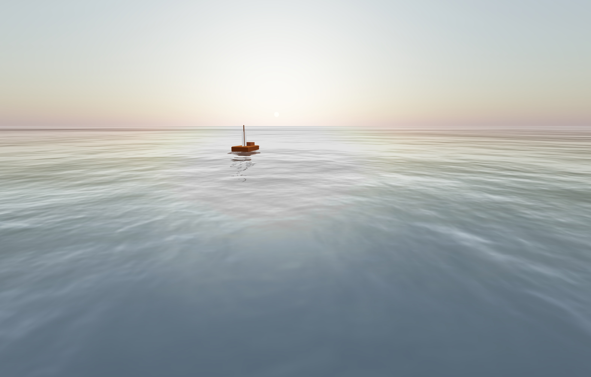
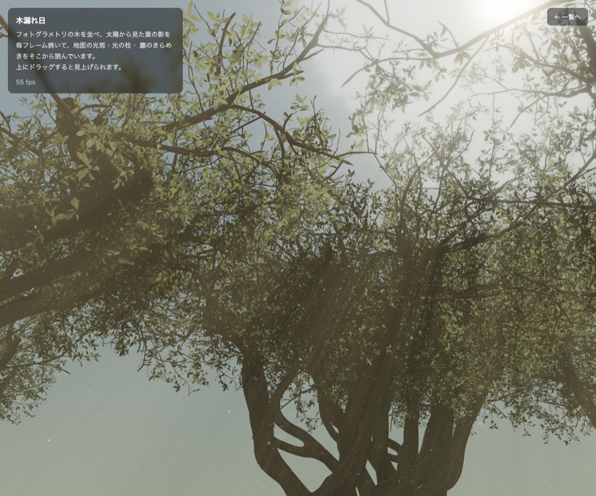
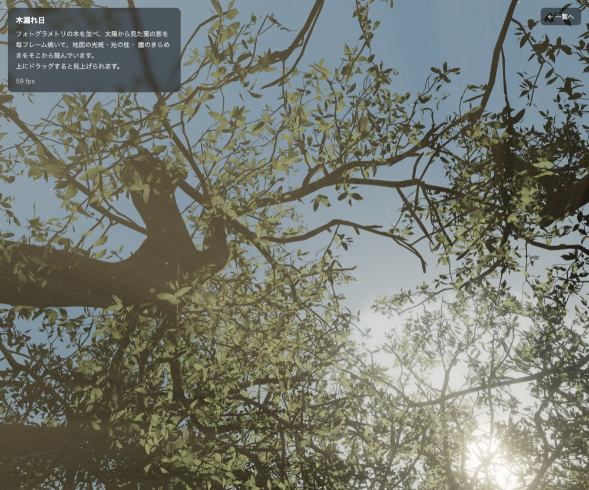
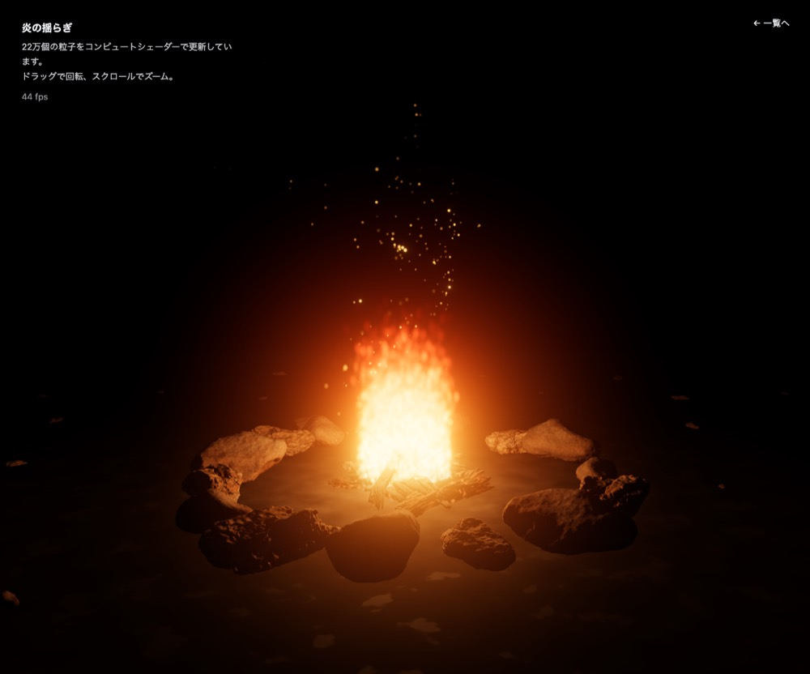
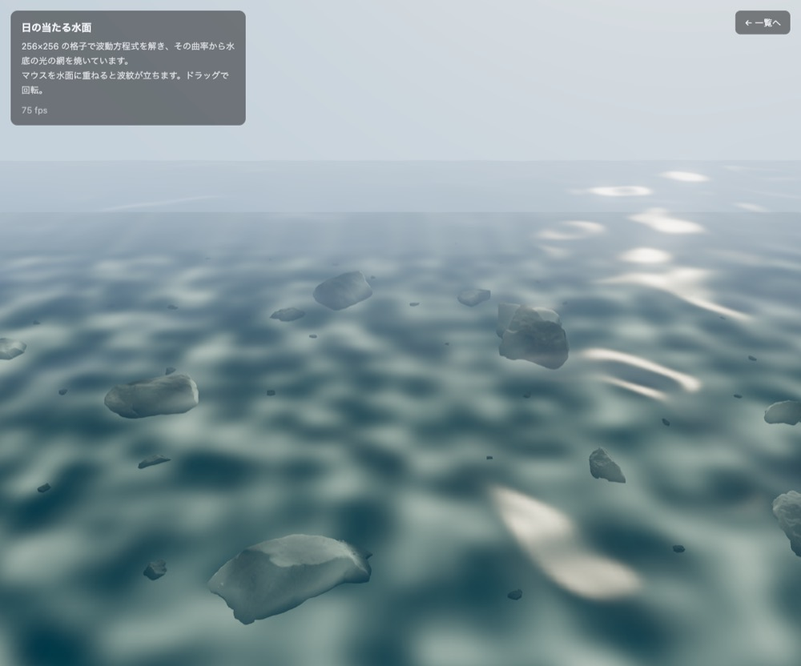

# Three.js サンプル

Three.js を使用したサンプルアプリケーション

## 概要

- React と TypeScript を使用してUIを構築
- Three.js を使用して3Dグラフィックスを描画



## 必要条件

- Node.js (バージョン 14 以上)
- npm 

## セットアップと実行手順

1. リポジトリをクローンします：
   ```
   git clone https://github.com/itwuthe3/webgpu-sample.git
   cd webgpu-sample
   ```

2. 依存関係をインストールします：
   ```
   npm install
   ```

3. アプリケーションをビルドします：
   ```
   npm run build
   ```

4. サーバーを起動します：
   ```
   node server.js
   ```

5. ブラウザで `http://localhost:3000` にアクセスして、アプリケーションを表示します。


## 海のサンプル

`Ocean.tsx` コンポーネントは、Three.jsを使用して動的な海面をシミュレートします。

### 主な機能

- リアルタイムで動く波のシミュレーショ��
- 光の反射効果による水面の表現
- 3D空間内でのカメラ操作

### 使用方法

1. アプリケーションを起動し、"海のサンプル"のリンクをクリックします。
2. マウスを使用して3D空間内のカメラを操作できます：
   - 左クリック＋ドラッグ: カメラの回転
   - 右クリック＋ドラッグ: カメラの平行移動
   - スクロール: ズームイン/アウト
3. 矢印キーを使用して船を操作できます：
   - 上矢印キー: 前進
   - 下矢印キー: 後退
   - 左矢印キー: 左回転
   - 右矢印キー: 右回転


### 技術的詳細

- Three.jsのShaderMaterialを使用してカスタムシェーダーを実装
- 頂点シェーダーとフラグメントシェーダーを組み合わせて波の動きと光の反射を表現
- React Three Fiberを使用してThree.jsをReactと統合

このサンプルは、WebGLを使用した高度な3Dグラフィックスとシェーダープログラミングの例を示しています。


## 3Dテキスト入力サンプル

`TextInput3D.tsx` コンポーネントは、3D���間でインタラクティブなテキスト入力と爆発エフェクトを実現します。

### 主な機能

- キーボードからの文字入力を3Dテキストとして表示
- Enterキーを押すと文字が爆発するアニメーション
- パーティクルシステムを使用した派手な爆発エフェクト
- 初回アクセス時のユーザーガイダンス表示

### 使用方法

1. アプリケーションを起動し、"3Dテキスト入力サンプル"のリンクをクリックします。
2. 画面上でキーボードを使って文字を入力します。
3. Enterキーを押すと、入力された文字が爆発します。
4. 爆発後、新しい文字を入力できます。

### 技術的詳細

- React Three Fiber と Three.js を使用して3D描画を実現
- React Spring を使用してスムーズなアニメーションを実装
- カスタムパーティクルシステムによる爆発エフェクト

このサンプルは、WebGLを使用した3Dグラフィックスとインタラクティブなユーザー入力の組み合わせを示しています。


## WebGPU サンプル（コンピュートシェーダー / TSL）

上の2つは WebGL ベースですが、以下の3つは `WebGPURenderer` と TSL
（Three.js Shading Language。WGSL を JavaScript で組み立てる仕組み）で書かれています。
いずれも「自然の中の光の揺らぎ」を、絵として描くのではなく計算から導いているのが主題です。

React Three Fiber は使わず、[`WebGPUCanvas.tsx`](src/components/webgpu/WebGPUCanvas.tsx) が
レンダラーの非同期初期化・リサイズ・描画ループだけを引き受け、各サンプルは素の Three.js で
シーンを組み立てています。

3つのサンプルに出てくるオブジェクト（木・林床・切り株・倒木・岩・薪）は、すべて
[Poly Haven](https://polyhaven.com/) の **CC0（パブリックドメイン）** アセットです。
[assets/polyhaven/](assets/polyhaven/) に同梱しているので、実行時の外部ダウンロードはありません
（合計およそ 70MB。うち 46MB が木のモデルです）。詳細は
[assets/polyhaven/CREDITS.md](assets/polyhaven/CREDITS.md)。

> WebGPU 非対応のブラウザでは、その旨のメッセージが表示されます。
> Chrome / Edge / Safari の最新版でお試しください。

### 木漏れ日（`/komorebi`）



木はフォトグラメトリの完全なモデル（`island_tree_02`、1本あたり **107万三角形**）をそのまま
林として並べています。幹・枝・葉が別マテリアルになっているので、部位ごとに塗り分けています。

そのうえで、**太陽の位置から見た「葉に遮られたか」を毎フレーム RenderTarget に焼いています**
（＝自前の影マップ）。

- 地面・切り株・倒木・岩の陰影：そのマップをぼかして引く
- 空中の光の柱：カメラから伸ばしたレイ上で26回サンプルして積分する
- 漂う8万個の塵：マップが明るいところに入った粒だけがきらめく
- 葉自身の陰影：自分を数えないよう太陽側にずらして引き、樹冠の内側を暗くする

葉はモデルローカル座標のノイズで風に揺らしていて、影マップ側も同じ計算を使うので、
葉が揺れると地面の光斑も一緒に揺れます。

**上にドラッグすると見上げられます。** 葉が裏から陽を透かして光り、隙間から陽が漏れます。



### 炎の揺らぎ（`/flame`）



22万個の粒子を1本のコンピュートシェーダーで更新します。各粒子は
「浮力で上昇 → fractal noise の乱流に舐められて崩れる → 寿命が尽きたら根元で再生成」
を繰り返し、残り寿命を温度とみなして白 → 黄 → 橙 → 赤へと色を変えます。
1.5% ほどは寿命の長い「火の粉」として、明滅しながら高く舞い上がります。

薪はスキャンした樹皮の塊（`bark_debris_01`）、囲いの石は乾いた岩（`namaqualand_boulders_01`）です。
どちらも火に近い側ほど炭化・煤けるよう塗り分けていて、薪は炭の割れ目から熾火が明滅して覗きます。

### 日の当たる水面（`/water-caustics`）



波を模様で描くのではなく、256×256 の格子で波動方程式を解いています。

1. 高さ場をコンピュートシェーダーで2ステップ進める（ping-pong する2つのバッファ）
2. その曲率から集光度（caustics）を別のバッファに焼く
3. 水面メッシュは頂点シェーダーで高さ場を読んで変位し、法線から空と太陽を反射する

水面のきらめきも水底で踊る光の網も、同じ1枚の高さ場から出てきます。
水底に沈めた苔むした岩（`rock_moss_set_01` / `_02` の13種）にも、深さから逆算した同じ式で
光の網が落ちます。マウスを水面に重ねると、その位置に波紋が立ちます。

### ポストエフェクト

3つとも `RenderPipeline` に bloom を挟んでいます。葉の隙間から漏れる陽、熾火、
水面のきらめきといった「明るいところ」が滲むことで、光そのものが見えるようになります。
